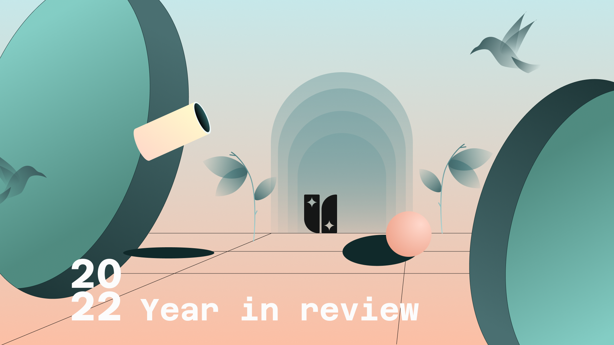

It's the year's end, and let's talk about what UniRep has accomplished in 2022.

2022 is an exciting year for us, and we had our first highlight moments in April during Devconnect, and we were finally able to show the public what we have been building in the past months. Although it was exciting, we quickly realized that our synchronizer could have been more optimal. It broke on 2nd day of the event, which caused the user state transition to fail. It was also challenging to debug such an event. That was the first lesson learned for us in 2022.

> Tips from Chiali: It's essential to test out your concept as soon as possible.
<iframe src="https://giphy.com/embed/3orieKKmYyvUdR3RkY" width="480" height="366" frameBorder="0" class="giphy-embed" allowFullScreen></iframe>
<a href="https://giphy.com/gifs/season-3-the-simpsons-3x13-3orieKKmYyvUdR3RkY">via GIPHY</a>

Right after the Devconnect, we took a step back to visit all the core components. The action of refracting is about time. Before April 2022, it was the exploring phase, we weren't entirely sure how to approach...etc. There were many to-do lists on the table.

One of the fascinating learning was on the demo app (attester), we realized that if we automatically airdrop Rep to anyone who signs up, it would cause infiltration and un-equality, but every attester has different needs. We went a long way in debating on how this attester should be experienced and came up with the solution of "subsidy."

We head down 100% between April and October to make it happen. During this time, we also iterated on how to work as a team and started using GitHub issues to manage our workflow and set up a two weeks sprint.

Right now, the team is focused on protocol v2. We have been releasing small pieces since December, along with [create-unirep-app](https://github.com/Unirep/create-unirep-app), the idea is to enable everyone to build their own app (attester) easily. Protocol v2 comes with many optimizations, and we also break up the packages to be easily imported, etc.

We hope that we will be able to test this developer experience with you soon. Please keep an eye on our updates.

<iframe src="https://giphy.com/embed/L4fB9di7ekn3F5PXaW" width="480" height="365" frameBorder="0" class="giphy-embed" allowFullScreen></iframe>
<a href="https://giphy.com/gifs/share-the-love-pass-it-forward-L4fB9di7ekn3F5PXaW">via GIPHY</a>

Here is the run-down list if you interested to learn more:

### Unirep and Unirep Social, Applied ZK
https://www.youtube.com/watch?v=6WnVCB7oK3U

### Building a Unirep ecosystem by Chance Hudson | Devcon Bogotá
https://www.youtube.com/watch?v=jd2Dg9czJzI

### Unirep Social: A demo application of Unirep protocol
https://www.youtube.com/watch?v=O2p92yM0-tI

### ZK HACK III - Build a ZKDAO with UniRep Protocol
https://www.youtube.com/watch?v=UoTekviYWts&list=PLj80z0cJm8QFGB6AsiAG3EB06L7xr5S1c&index=45

### How to build a simple app with UniRep protocol - Taiwan/Chinese lang.
https://youtu.be/9nQHoYtXBnM

Lastly, if you are thinking of playing create-unirep-app, although it's not fully completed: 
https://www.npmjs.com/package/create-unirep-app

If you are interested in contributing with us, drop us message in our [discord!](https://discord.gg/UmS33GXkD2)
