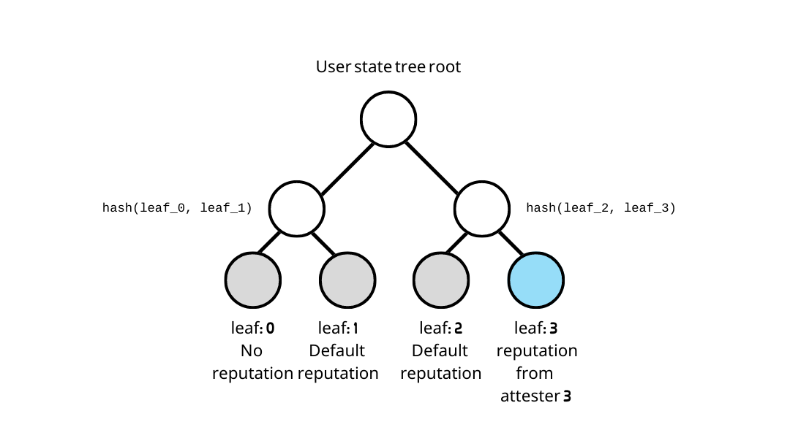
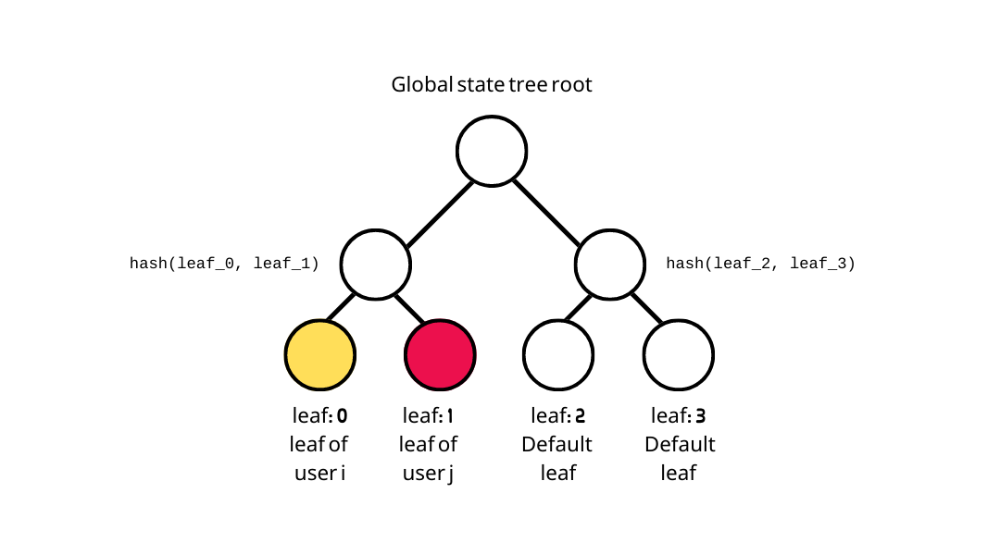

# Trees

## **User state tree**

* A user state tree is a **sparse merkle tree** with it's leaves storing reputation received from each attester, e.g.,
  * a user state tree leaf = hash of the reputation



* Hash of the reputation:

```typescript
const hashReputation = hash(posRep, negRep, graffiti, signUp)
```

where

* `posRep` is the positive reputation given by the attester 
* `negRep` is the negative reputation given by the attester 
* `graffiti` is the message given by the attester 
* `signUp` indicates if the attester authenticates the user

If there is no reputation from attester, then the leaf stores a default reputation:

```typescript
const defaultReputation = hash(0,0,0,0)
```


The index `0` is reserved to have no reputation (default reputation) since the attester ID starts from index `1`.


## **Global state tree**

* A global state tree stores the updated user state after a user signs up and a user performs the [user state transition](user-state-transition.md).
* It is an **incremental merkle tree** with it's leaves storing users' `identityCommitment`s and `userStateRoot`s, e.g.,
  * a global state tree leaf: `hash(`<mark style="color:green;">`identityCommitment`</mark>`,`` `<mark style="color:red;">`userStateTreeRoot`</mark>`)`
  * The default leaf is `0`




**NOTE:** this is an incremental merkle tree so leaves are inserted from left (leaf index 0) to right, one by one, instead of inserted directly into the specified leaf index.

**NOTE:** since global state tree leaf is the hash of `identityCommitment` and `userStateRoot`, others will be not be able to tell which user (his `identityCommitment`) inserted his user state into global state tree.


## **Epoch tree**

* An epoch tree is used to **prevent users from omitting any attestation** attesting to the user. If the user skip one attestation, the hash chain and the output epoch tree root will be different from others.
* An epoch tree is a **sparse merkle tree** with it's leaves storing hashchain results of each epoch key, e.g.,
  * leaf index: epoch key
  * leaf value: sealed hash chain\
    The sealed hash chain is computed by

```typescript
const hashChainResult = hash(attestation_3, hash(attestation_2, hash(attestation_1, 0)))
const sealedHashChain = hash(1, hashChainResult)
```


The hash chain is **sealed** because it prevents epoch keys from receiving attestations anymore.\
See: [Epoch Transition](epoch-transition.md)


.png>)

An attestation includes the following data:

```solidity
struct Attestation {
  // The attester’s ID
  uint256 attesterId;
  // Positive reputation
  uint256 posRep;
  // Negative reputation
  uint256 negRep;
  // A hash of an arbitary string
  uint256 graffiti;
  // A flag to indicate if user has signed up in this leaf
  uint256 signUp;
}
```


A reputation includes the following data: `posRep, negRep, graffiti, signUp`.\
``It does not include `attesterId` like an attestation does because reputation is already stored in user state tree with `attesterId` as leaf index\
See: [Reputation](reputation.md)

