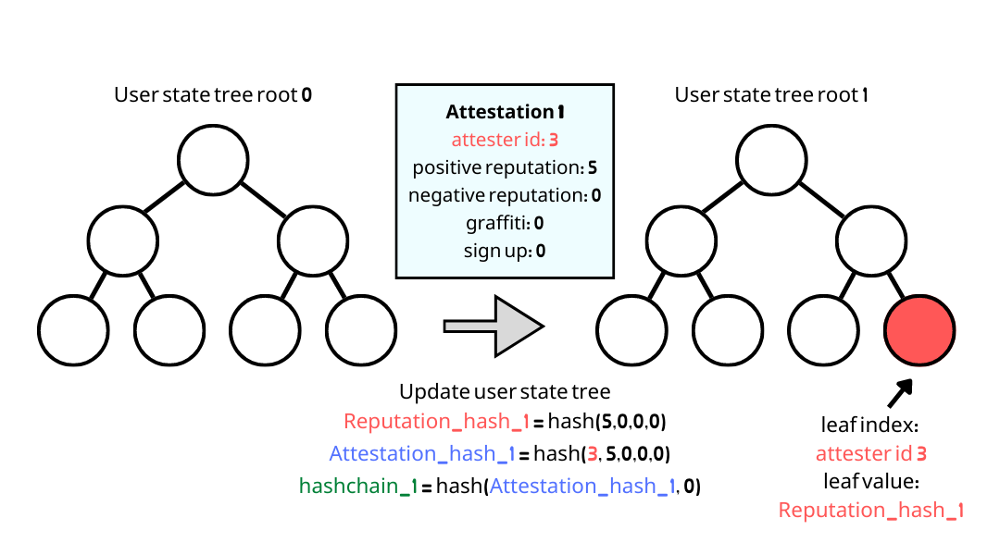
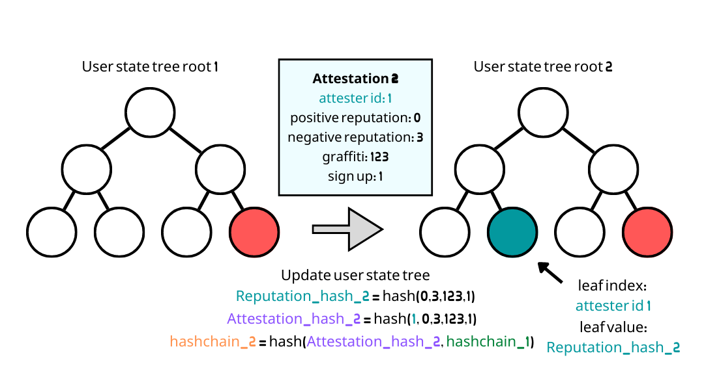

# User State Transition

### Why users have to perform user state transition?

User state transition is used to&#x20;

* Make sure users process their attestations correctly including the bad reputation.
* Generate a new user state in a new epoch to prove the latest reputation.

After user performs user state transition, he can&#x20;

1. Prove the latest reputation status.
2. Generate new epoch key proofs to receive attestations in the latest epoch.

### Workflow of a user state transition

#### 1. User computes epoch key of the latest transition (or sign up) epoch


#### 2. Update user state tree





#### 3. Check if epoch tree root matches computed hashchains and epoch keys

.png>)

#### 4. Compute a new global state tree leaf

```typescript
const newLeaf = hash(idCommitment, userStateTreeRoot)
```


#### 5. Call unirep smart contract to insert a new global state tree leaf

User performs user state transition by calling [`updateUserStateRoot()`](https://github.com/Unirep/Unirep/blob/f3502e1a551f63ab44b73444b60ead8731d45167/packages/contracts/contracts/Unirep.sol#L559)``

* User will attach a [User State Transition Proof](../../circuits/user-state-transition-proof.md) when calling `updateUserStateRoot`. Others can make sure if the user state transition is correct by verifying the User State Transition Proof.
* Once the user performed user state transition, his user state will be inserted into the [global state tree](trees.md#global-state-tree) of the latest epoch.
* So if a user does not perform user state transition during an epoch, his user state will not be in the global state tree of that epoch.


See also

* [Trees](trees.md)
* [Epoch Transition](epoch.md)
* [User State Transition Proof](../../circuits/user-state-transition-proof.md)

